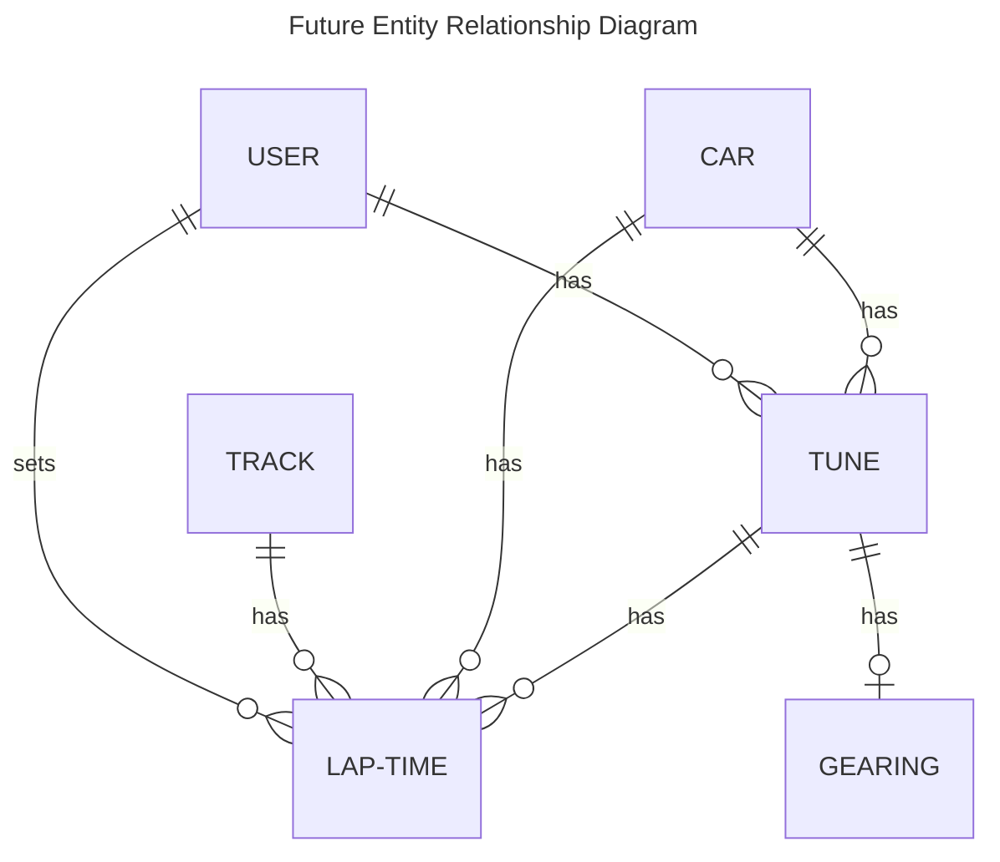
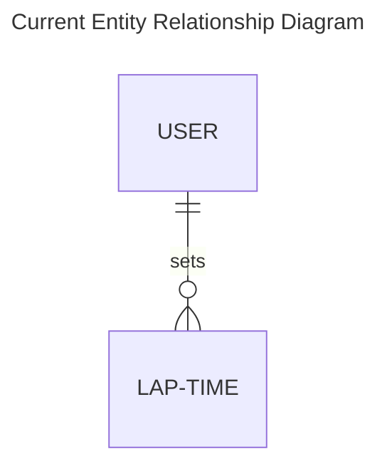

# ERD





Lap Time
- Time (integer of milliseconds)
- User
- Car (text)
- Track (text)
- Tune (text)
- Controller/Wheel/Keyboard
- Video Link
- Other Notes

```shell
mix phx.gen.live Leaderboard LapTime lap_times lap_time_millis:integer car:string track:string tune:string input_method:string video_url:string notes:string user_id:references:users --binary-id
```
