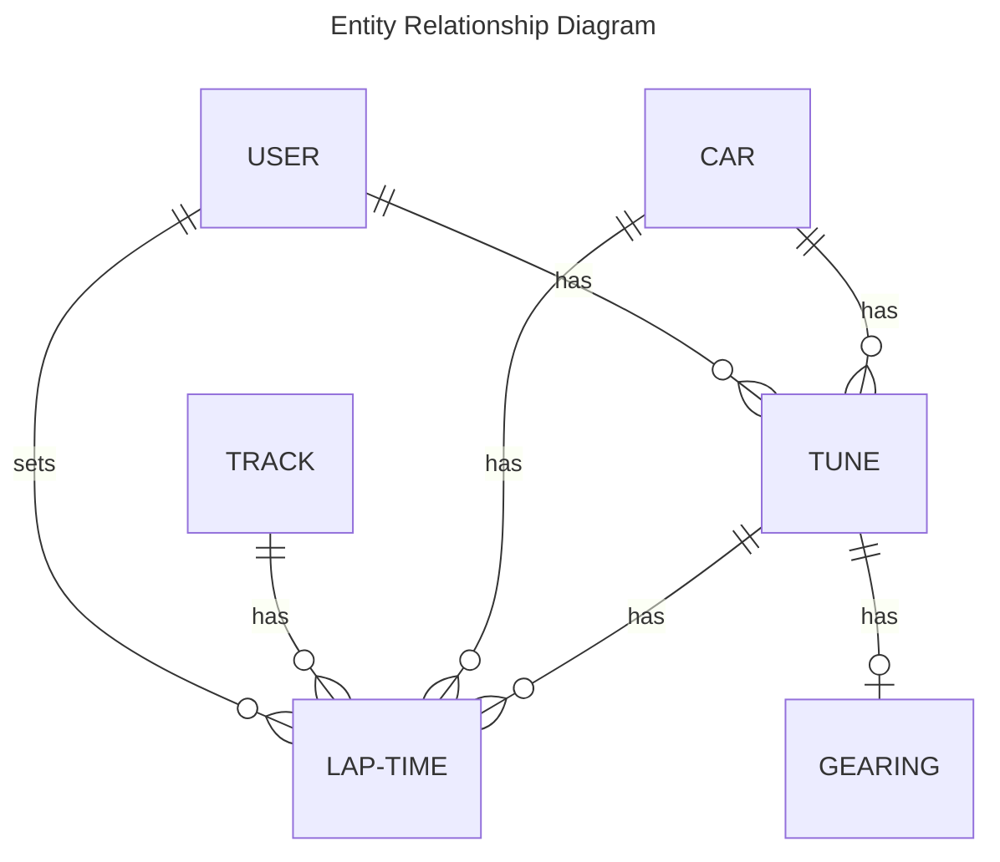

# ERD

```mermaid
---
title: Entity Relationship Diagram
---
erDiagram
    USER ||--o{ LAP-TIME : sets
    USER ||--o{ TUNE : has
    TRACK ||--o{ LAP-TIME : has
    CAR ||--o{ LAP-TIME : has
    TUNE ||--o{ LAP-TIME : has
    TUNE ||--o| GEARING : has
    CAR ||--o{ TUNE : has
```

Lap Time
- Time (integer of milliseconds)
- User
- Car
- Track
- Tune
- Controller/Wheel/Keyboard
- Verified/Unverified
- Video Link
- Other Notes